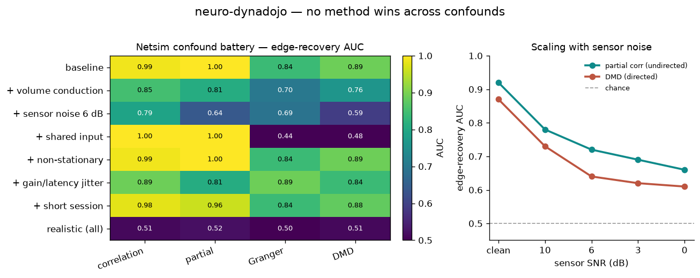

# neuro-dynadojo

[](https://github.com/m9h/neuro-dynadojo/actions/workflows/ci.yml)
[](LICENSE)

**A ground-truth benchmark for M/EEG dynamics — connectivity recovery, directed flow,
traveling waves, and foundation-model probing — under realistic sensor confounds.**



Real M/EEG has no known connectivity ground truth, so a method's claim to *recover
structure* can only be validated on simulation. [FSLNets/netsim](https://www.fmrib.ox.ac.uk/datasets/netsim/)
(Smith et al. 2011) established that discipline for fMRI; [DynaDojo](https://github.com/DynaDojo/dynadojo)
(Bhamidipaty et al. 2023) generalised it into an extensible `System × Algorithm × Challenge`
platform with scaling diagnostics. **neuro-dynadojo ports that discipline to
electrophysiology** and adds the three things fMRI never had — a tunable dynamical
**regime**, conduction **delays**, and an observation model with **volume conduction** —
then extends the `Algorithm` slot so a frozen **EEG foundation model** can be evaluated the
same way as a classical estimator.

## Why

- **Methods are proposed without comparison.** neuro-dynadojo scores correlation, partial
  correlation, coherence / imaginary coherence / wPLI / PLV, Granger, and DMD on the *same*
  ground truth under the *same* confounds — so "which method wins" is a table, not an assertion.
- **Foundation models are evaluated on downstream accuracy, not mechanistic content.** A model
  that classifies seizures at 95% may not encode *coupling direction* or tell a *traveling wave*
  from independent oscillators. On simulated data the answer is known: freeze the model, embed
  the recording, and linearly probe the embedding for the generative factor. This complements
  real-data identity audits ([fmscope](https://github.com/Jimmy110101013/fmscope), *The Identity
  Trap in EEG Foundation Models*; Tang et al. 2026) — there the confound is unknown; here it is
  known by construction.
- **One generative family overfits.** netsim used a single linear-DCM+balloon model; methods
  overfit it. neuro-dynadojo ships amplitude-coupled, phase-coupled, and traveling-wave regimes,
  plus a **real diffusion-MRI connectome** (Desikan-68), so a method can't win by memorising one physics.

## Install

```bash
git clone https://github.com/m9h/neuro-dynadojo
cd neuro-dynadojo
pip install -e .            # core: numpy, scipy, scikit-learn
pip install -e .[fm]        # + torch, braindecode  (load & probe a foundation model)
```

## Quickstart — recover a connectome

```python
import neurodynadojo as ndd

sys = ndd.NetsimSystem(seed_struct=0, back=0.3, leak=0.8, snr=6.0)   # directed net, volume conduction + noise
obs, C = sys.simulate(seed=0)                                        # (n_nodes, n_times), ground-truth connectome
score = ndd.partialcorr_fc(obs)
auc   = ndd.edge_recovery_auc(score, sys.undirected_truth())        # how well structure is recovered
```

## Quickstart — probe a foundation model

```python
import neurodynadojo as ndd
from neurodynadojo.probes import probe_factor, braindecode_embed, bandpower_embed

# bring your own frozen FM (e.g. a braindecode model, classifier head removed):
#   embed = lambda obs: braindecode_embed(model, obs)          # (n_ch, n_times) -> vector
embed = lambda obs: bandpower_embed(obs, fs=250.0)             # spectral baseline (the floor to beat)

# does the representation encode conduction DELAY, in sensor space, under volume conduction?
res = probe_factor(embed, ndd.HopfNetworkSystem, factor="velocity",
                   values=[3, 5, 8, 12], task="regress", space="sensor", leak=0.8, snr=6.0)
print(res)   # {'metric': 'r', 'r': ..., 'r2': ..., 'n': ...}
```

Generators emit `(n_ch, n_times)` sensor recordings (braindecode's input shape) with known
factors — coupling, delay, regime, wavenumber, frequency, flow direction — so any FM can be
scored on whether its embedding recovers the physics. See
[`examples/fm_probe.py`](examples/fm_probe.py) (spectral baseline — the floor to beat),
[`examples/fm_probe_braindecode.py`](examples/fm_probe_braindecode.py) (any braindecode model),
and [`examples/fm_probe_bendr.py`](examples/fm_probe_bendr.py) (a **real pretrained FM**, BENDR).

### First real-FM result (BENDR) — and an honest caveat

Probing a frozen, pretrained **BENDR** (loaded from the HF Hub via braindecode) on our 20-ch
synthetic sensor recordings, factor-recovery |r| vs the spectral baseline:

| factor | BENDR | spectral baseline |
|---|---|---|
| frequency | 0.23 | **0.94** |
| coupling | 0.30 | **0.95** |
| velocity | 0.32 | **0.97** |
| phase-lag | 0.15 | **0.57** |

BENDR underperforms a trivial baseline on *every* factor — but this is **not** a verdict on the
model. A diagnostic shows its embedding is nearly **invariant** to our input (between-frequency
shift < within-class noise, robust across input scales): the synthetic data is
**out-of-distribution** (generic montage, synthetic signal statistics), so the pretrained
representation barely responds. That is itself a finding — *pretrained EEG-FM embeddings do not
transfer off-the-shelf to simulated data* — and it sets the next milestone: **realistic montages
and signal statistics** so an FM receives in-distribution input and the mechanistic probe becomes
fair. The harness is done; the realism is the science ahead.

## What the benchmark shows (the honest through-line)

- **No method or challenge wins everywhere.** The identifiable ground truth *and* the winning
  method shift with regime: correlation recovers adjacency under amplitude/phase coupling; a
  traveling wave hands adjacency to **partial correlation**, exposes **directed flow** (DMD, Granger),
  and makes the **wavenumber** trivially readable.
- **Lag-robust ≠ better recovery.** Imaginary coherence / wPLI are correct (a controlled
  quarter-cycle lag → ≈1.0) yet sit near chance for structure recovery, because node-coupled
  dynamics imprint connectivity on the *zero-lag* component.
- **Volume conduction and shared input are the dominant confounds, and they interact** — leakage
  defeats partial correlation's immunity to a shared global input. An adversarial search over the
  confound grid rediscovers this automatically.
- **One thing survives a real recording:** the **wavenumber** is recovered at ceiling across
  leakage *and* every sensor SNR down to 0 dB.
- **Scaling laws:** recovery falls as node count grows, rises then saturates with duration, climbs with SNR.
- **Real connectomes are much harder than synthetic.** On the Desikan-68 diffusion-MRI graph,
  clean recovery is only ~0.67 (matching empirical SC–FC) and **volume conduction alone collapses it
  to chance** — the synthetic modular graphs (0.9+) systematically overstate recoverability.

An interactive figure of the regime × challenge identifiability matrix, confound battery, and
scaling laws is in [`figures/`](figures/).

## Layout

```
neurodynadojo/
  generators/   Systems: hopf (Hopf / Kuramoto / RingWave), netsim (Smith confound battery + real connectome), waves (Budzinski)
  algorithms/   fc (correlation, partial, coherence, imag-coh, wPLI, PLV), directed (Granger, DMD)
  challenges/   recovery metrics (edge AUC, directed AUC, wavenumber consistency)
  probes/       FM-ready linear probing (bring-your-own embed_fn; braindecode adapter; spectral baseline)
  bench.py      run_benchmark (scaling axes) + adversarial_search (auto-find breaking confounds)
examples/       runnable scripts reproducing the tables and the figure
```

## Related work & credit

- **FSLNets / netsim** — Smith, Miller, Salimi-Khorshidi, Webster, Beckmann, Nichols, Ramsey &
  Woolrich (2011), *Network modelling methods for FMRI*, NeuroImage 54:875. The ground-truth-recovery template.
- **DynaDojo** — Bhamidipaty, Bruzzese, Tran, Mrad & Kanwal (2023), *NeurIPS Datasets & Benchmarks*.
  The `System × Algorithm × Challenge` + scaling framing.
- **braindecode** — the PyTorch EEG model zoo with HuggingFace-style `from_pretrained`; the FM loading layer this builds on.
- **fmscope** (*The Identity Trap in EEG Foundation Models*) and **Tang et al. 2026** — complementary
  *real-data* FM audits; neuro-dynadojo is the synthetic, ground-truth counterpart.
- **Budzinski & Muller** (Chaos 2022; Phys Rev Research 2023) — the structure→traveling-wave generator.

## License

MIT.
