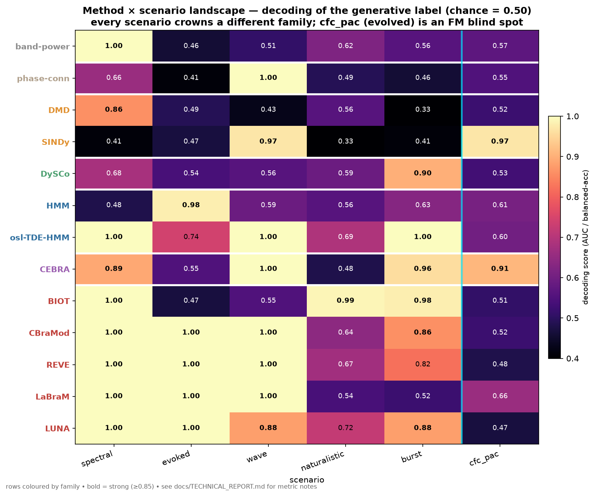

# neuro-dynadojo: an adversarial ground-truth benchmark for M/EEG dynamics and foundation-model probing

**Technical report — draft for review.**
Morgan Hough. Code: https://github.com/m9h/neuro-dynadojo (MIT).

---

## Abstract

Electroencephalography (EEG) analysis is being reshaped twice over: by a proliferation of
*dynamics* methods (system identification, dynamic connectivity, state-space models, latent
embeddings) and by *foundation models* (FMs) pretrained on large EEG corpora. Both trends invite
the same question — *which method actually recovers which kind of neural dynamics?* — and both are
usually evaluated on real datasets where the generative truth is unknown and a single headline
number hides where a method wins and where it fails.

`neuro-dynadojo` is a ground-truth benchmark that answers this question by construction. It
generates labelled, EEG-like sensor recordings from known generative mechanisms under realistic
volume-conduction and 1/f statistics, and scores an open field of contenders — classical spectral
and connectivity measures, system identification (SINDy, DMD/Koopman), dynamic connectivity
(DySCo), state-space models (a lightweight HMM and osl-dynamics' TDE-HMM), a contrastive latent
embedding (CEBRA), and five pretrained EEG foundation models (BIOT, CBraMod, LUNA, REVE, LaBraM) —
on the *same* tasks with the *same* probe. The scenarios are grounded in real statistics from the
Healthy Brain Network (HBN) cohort, following the logic by which FSLNets/*netsim* grounded fMRI
network-recovery simulations in the HCP connectome.

The benchmark is deliberately **adversarial and self-improving**: an LLM-driven evolutionary loop
([LLaMEA](https://github.com/XAI-liacs/LLaMEA)) writes and refines *scenario-generator code* to
maximise disagreement among the methods, breeding harder discriminative cases than we hand-design.
This loop produced — and then, under a confound-aware fitness, *repaired* — a cross-frequency
phase-coupling scenario (`cfc_pac`) with matched marginal power that **every one of the five
foundation models, and every spectral / dynamic-connectivity / state-space method, fails to decode
(median AUC 0.46–0.65 across 12 seeds), while nonlinear system identification (SINDy, 0.99) and
contrastive latent embedding (CEBRA, 0.94) read it cleanly.** We report this as a synthetic
existence proof of a structured EEG regime outside the current EEG-FM representation, and offer the
platform as a reusable instrument for locating such regimes.

---

## 1. Motivation

Two observations motivate the project.

**(1) A single-number leaderboard hides method specialisation.** Whether comparing classical
pipelines or foundation models, the field tends to rank methods by one aggregate score on one
dataset. But methods are not uniformly better or worse — they are *specialised*. A power-spectral
feature is unbeatable when the label is a band shift and blind when the label is a phase relation
with matched power. A traveling-wave direction is visible to phase/connectivity methods and
invisible to any amplitude statistic. Aggregate scores average these regimes together and erase the
structure a practitioner most needs: *which method for which question.*

**(2) Real data cannot adjudicate this, because its generative truth is unknown.** The classical
response in fMRI was FSLNets/*netsim* (Smith et al., 2011): simulate networks with *known*
connectivity, pass them through a realistic forward model, and measure which method recovers the
truth. `neuro-dynadojo` ports that logic to M/EEG and extends it to the foundation-model era —
every scenario has a known generative factor as its label, so "did the method recover it?" is a
well-posed, quantitative question rather than a correlation with an unvalidated proxy.

The design target is therefore not "the best method" but a **method × scenario matrix** in which
different families win different rows — the diagnostic object a benchmark battery exists to produce.

---

## 2. The platform

### 2.1 Generators and forward model

Recordings live in *sensor* space. Source activity from a small set of dipoles is projected to a
fixed electrode montage through a radial lead field, then summed with a spatially-correlated 1/f
background (40 background dipoles emitting pink noise through the same lead field). Channel identity
is held fixed across all trials of a scenario — an early bug in which the montage was regenerated
per trial collapsed every method to chance and is a cautionary detail for anyone building such
simulators. Signal and background are each normalised to controlled relative RMS, because the
lead field's absolute scale is tiny and would otherwise bury the signal.

### 2.2 HBN-grounded scenarios

As HCP's connectome grounded netsim, we ground the scenarios in measured statistics of the HBN
EEG cohort: the aperiodic (1/f) exponent (≈ −1.13), oscillatory peak bands, and evoked waveform
latency (≈ 0.28 s). Each `scenario(n_per, seed)` returns `(X, y, ch_names)` with
`X ∈ ℝ^{2·n_per × 32 × 1000}` (32 channels, 4 s at 250 Hz), a balanced binary label `y`, and a
fixed montage. Six scenarios, each engineered so a *different* method family should win:

| scenario | generative label | intended winner |
|---|---|---|
| `spectral` | oscillatory peak band (6 vs 11 Hz) | band-power |
| `evoked` | ERP Gabor **phase** (0 vs π/2) at 0.28 s, matched power spectrum | waveform / FMs |
| `wave` | traveling-wave **direction** (forward vs backward) | phase / directed connectivity |
| `naturalistic` | theta–gamma coupling present vs absent | foundation models |
| `burst` | gamma-burst **rate** (few vs many) | dynamic-FC / band-power |
| `cfc_pac` | PAC **gating phase** with matched marginal power | nonlinear system-ID (see §4) |

`cfc_pac` was not hand-designed; it was discovered by the adversarial loop (§4) and folded back
into the battery as a first-class scenario.

### 2.3 The contender zoo

Every contender is an `(N, C, T) → (N, D)` feature extractor, scored by a common cross-validated
linear probe (5-fold logistic regression, balanced-accuracy or AUC; chance = 0.50). This mirrors
the standard "frozen representation + linear probe" protocol used to evaluate foundation models, so
classical methods and FMs are judged identically.

- **Spectral / connectivity** — log band-power; imaginary-coherence phase connectivity.
- **System identification** — SINDy (PySINDy; sparse governing-equation coefficients of a
  PCA-reduced trajectory); DMD/Koopman (operator eigenvalues).
- **Dynamic connectivity** — DySCo (sliding-window connectivity eigen-spectrum: mean, metastability,
  reconfiguration rate), after Rabuffo et al. (2025).
- **State-space** — a lightweight Gaussian HMM (hmmlearn) as a proxy, *and* osl-dynamics' TDE-HMM
  (time-delay-embedded HMM), the signature Oxford-OSL M/EEG method, run in a dedicated container.
- **Latent embedding** — CEBRA (Schneider, Lee & Mathis, 2023), trained *self-supervised*
  (CEBRA-Time, no labels), embeddings pooled per recording — the fair analogue of FM probing.
- **Foundation models** — BIOT, CBraMod, LUNA, REVE, LaBraM, loaded frozen via braindecode /
  hand adapters and probed identically.

Interoperability is deliberate: FM loading reuses the *emeg-fm* zoo (NeuroTechX EEG-FM Atlas), the
linear probe reuses *fmscope*'s protocol (from the "Identity Trap in EEG-FMs" work), and osl-dynamics
runs in the Oxford-OSL container. `neuro-dynadojo` supplies the ground-truth data and the harness;
it does not reimplement the models.

---

## 3. Result 1 — the method × scenario landscape

Cross-validated decoding of the generative label, chance = 0.50 (**bold** = clear winner).
Classical / system-ID / state-space / latent rows: 5-fold LogReg **AUC**, n = 60. Foundation-model
and phase-conn rows: fmscope balanced-accuracy probe, n = 60 — same chance level, and the shared
rows (band-power, DMD, DySCo) agree across the two scorers within ≈ 0.05. osl-TDE-HMM: n = 40.

| method (family) | spectral | evoked | wave | naturalistic | burst | cfc_pac |
|---|---|---|---|---|---|---|
| band-power (spectral) | **1.00** | 0.46 | 0.51 | 0.62 | 0.56 | 0.57 |
| DMD (Koopman) | 0.86 | 0.49 | 0.43 | 0.56 | 0.33 | 0.52 |
| SINDy (system-ID) | 0.41 | 0.47 | **0.97** | 0.33 | 0.41 | **0.97** |
| DySCo (dynamic-FC) | 0.68 | 0.54 | 0.56 | 0.59 | **0.90** | 0.53 |
| HMM (state-space, hmmlearn) | 0.48 | **0.98** | 0.59 | 0.56 | 0.63 | 0.61 |
| **osl-dynamics TDE-HMM** | **1.00** | 0.74 | **1.00** | 0.69 | **1.00** | 0.60 |
| CEBRA (latent) | 0.89 | 0.55 | **1.00** | 0.48 | **0.96** | **0.91** |
| phase-conn | 0.66 | 0.41 | **1.00** | 0.49 | 0.46 | 0.55 |
| BIOT (FM) | 1.00 | 0.47 | 0.55 | **0.99** | **0.98** | 0.51 |
| CBraMod (FM) | 1.00 | **1.00** | **1.00** | 0.64 | 0.86 | 0.52 |
| REVE (FM) | 1.00 | **1.00** | **1.00** | 0.67 | 0.82 | 0.48 |
| LaBraM (FM) | 1.00 | **1.00** | **1.00** | 0.54 | 0.52 | 0.66 |
| LUNA (FM) | 1.00 | **1.00** | 0.88 | 0.72 | 0.88 | 0.47 |



Four observations.

1. **No family dominates; every scenario has a different winner.** `spectral` → band-power /
   TDE-HMM; `evoked` → HMM & the phase-FMs; `wave` → SINDy, CEBRA, phase-conn, TDE-HMM & phase-FMs;
   `naturalistic` → BIOT; `burst` → DySCo, CEBRA, TDE-HMM & BIOT. This is the intended, and the
   informative, outcome.

2. **The foundation models themselves split into two camps.** CBraMod / REVE / LaBraM excel at
   *phase / waveform* structure (evoked, wave) but are weaker on cross-frequency amplitude scenarios;
   BIOT is the mirror image — weak on evoked/wave, strongest on `naturalistic` and `burst`. A single
   leaderboard number hides this; the battery exposes it.

3. **Implementation, not just family, moves the result.** The lightweight Gaussian-HMM stand-in
   scores 0.48 / 0.59 / 0.63 on spectral / wave / burst, whereas osl-dynamics' *proper* TDE-HMM
   scores 1.00 / 1.00 / 1.00 — time-delay embedding is what lets a state model see spectral and
   cross-channel phase structure. A benchmark that used only the convenient proxy would badly
   undersell the state-space family. We therefore report both.

4. **`cfc_pac` is anomalous** — no FM and no spectral/state-space method reads it, only SINDy and
   CEBRA. That column is the subject of §5, and it is not a hand-tuned artefact: it was *bred*.

---

## 4. The adversarial loop: what LLaMEA has been doing

The battery above is hand-designed, which bounds it by the designer's imagination. To push past
that, `neuro-dynadojo` treats scenario design itself as a search problem and hands it to an
LLM-driven evolutionary algorithm.

### 4.1 Mechanism

[LLaMEA](https://github.com/XAI-liacs/LLaMEA) (van Stein & Bäck) couples an LLM with a `(μ+λ)`
evolutionary loop that writes and mutates *code*. We make the evolved artefact a **scenario
generator**: the LLM emits a `Scenario` class whose `generate(n_per, seed)` returns a labelled
dataset in the benchmark's format. Each candidate is executed (behind a hard timeout, since it is
untrusted generated code), scored by the whole method zoo, and the resulting fitness plus a
natural-language critique are fed back for the next mutation. We added a small Anthropic backend so
the loop runs on Claude (Opus 4.8 / Sonnet), which LLaMEA does not ship natively.

### 4.2 Fitness design — and a lesson in adversarial confounds

We ran two fitness objectives, and the contrast between them is itself a finding.

**(a) Raw disagreement.** Fitness = standard deviation of per-method AUC: reward scenarios on which
the methods most *disagree*, since maximal disagreement is the most informative row to add. With a
Sonnet backend (budget 12) this converged (fitness 0.095) on a clean traveling-wave-direction
scenario — SINDy 0.66, band-power blind at 0.52 — rediscovering, unprompted, why spectral methods
cannot see propagation direction. With an Opus backend (budget 30) it climbed much higher (0.258,
above the hand-tuned battery's ≈ 0.21) onto a theta–gamma PAC scenario.

But that high-scoring Opus scenario was **gamed by an unintended confound**. Its construction
scrambled the gamma envelope for one class, which — the model's stated intent notwithstanding —
leaked a gamma-band *power* difference. Band-power and DMD therefore aced it (1.00) while the
nonlinear methods it was supposedly built for failed. The disagreement objective rewarded a
spectral leak, not the intended cross-frequency structure. This is the canonical failure mode of
ground-truth adversarial design, produced here in miniature and in the open.

**(b) Confound-aware targeted fitness.** We reformulated the objective to be leak-proof:

> fitness = (best AUC among genuine-dynamics methods {SINDy, DySCo, HMM}) − (best AUC among
> spectral/amplitude methods {band-power, DMD}).

A scenario now scores only if it beats **every** spectral method, so any leaked power/amplitude cue
is *penalised* rather than rewarded. Re-scored under this objective, the gamed Opus scenario drops
to −0.39 while the genuine Sonnet wave scenario rises to +0.14 — the fitness discriminates exactly
as intended. Re-run under it (Opus, budget 30), **the same model that previously cheated was forced
to do the real work**: it built a genuinely spectrum-matched 6→40 Hz phase-coupling contrast,
adding explicit anti-leakage steps of its own — high-passing the coupled high-frequency component
so no envelope bleeds into the low band, renormalising HF power, and matching per-channel variance —
so that band-power *and* DMD sit at chance while only SINDy recovers the label (1.00). The champion
generalises to held-out seeds (margin +0.49 at an unseen seed), i.e. it is a reproducible mechanism,
not a seed-specific overfit.

This is the loop we most want reviewed: a naïve objective was gamed, the failure was diagnosed, the
objective was reshaped, and the *same* generator then produced a legitimate, generalising
ground-truth scenario. That scenario is `cfc_pac`, now folded into the battery (§2.2). All three
evolved champions are stored verbatim in `examples/evolved_scenario*.py` for inspection.

---

## 5. Result 2 — `cfc_pac` is a blind spot for the foundation-model zoo

We stress-tested the evolved scenario against the full zoo across **12 independent scenario seeds**,
scoring every method with **one consistent metric** (5-fold LogReg AUC) so foundation models and
classical methods are strictly comparable. Median AUC per method (full distributions in
`figures/cfc_pac_raincloud.png`):

| reads it | median AUC | | blind (≈ chance) | median AUC |
|---|---|---|---|---|
| **SINDy** (system-ID) | **0.99** | | LaBraM (FM) | 0.65 |
| **CEBRA** (latent) | **0.94** | | LUNA (FM) | 0.59 |
| | | | CBraMod (FM) | 0.57 |
| | | | REVE (FM) | 0.56 |
| | | | DySCo | 0.56 |
| | | | band-power | 0.52 |
| | | | BIOT (FM) | 0.51 |
| | | | HMM | 0.50 |
| | | | DMD | 0.48 |
| | | | osl-TDE-HMM | 0.46 |

The separation is categorical and robust across seeds: only nonlinear system identification and
contrastive latent embedding cross chance; **all five foundation models, every spectral and
dynamic-connectivity measure, and the proper state-space model sit at chance.** The signal is a
cross-frequency phase relationship with matched marginal power — nothing a band-limited amplitude
statistic can expose, and, evidently, nothing the current EEG-FM pretraining objectives have learned
to represent.

**Scope and interpretation.** This is a statement about a *synthetic* scenario, not a claim that
real EEG contains this exact structure or that these FMs are broadly deficient — indeed the same FMs
*win* other rows of §3 (evoked, wave, naturalistic). The contribution is narrower and, we think,
useful: an existence proof, constructed from known ground truth and reproducible across seeds, that
there is a well-defined, physiologically-motivated class of dynamics (matched-power cross-frequency
phase coupling) that lies outside what today's EEG foundation models encode, and a method
(`neuro-dynadojo`) for discovering and characterising such classes automatically.

---

## 6. Reproducibility

```bash
pip install -e '.[sysid,latent]'          # classical + system-ID + CEBRA contenders
pytest                                     # 24 tests, incl. scenario/fitness contracts

# hand-designed battery × classical/sysid/latent methods (venv)
python examples/scenario_benchmark.py

# foundation-model zoo (emeg-fm NGC container)
bash examples/run_leaderboard_container.sh examples/scenario_benchmark.py

# osl-dynamics TDE-HMM (Oxford-OSL container)
bash examples/run_osl_container.sh

# adversarial scenario evolution (needs an LLM key)
python examples/llamea_evolve_scenarios.py          # NDD_MODE=targeted|disagree, NDD_MODEL, NDD_BUDGET

# the cfc_pac raincloud (12-seed distributions across every method)
python examples/cfc_pac_seeds.py                    # + container/osl passes accumulate one JSON
python examples/plot_cfc_pac_raincloud.py figures/cfc_pac_seeds.json figures/cfc_pac_raincloud.png
```

The evolved champions (`examples/evolved_scenario*.py`) and the raincloud's underlying per-seed
scores (`figures/cfc_pac_seeds.json`) are committed so results can be re-derived exactly.
[`docs/REVIEW_GUIDE.md`](REVIEW_GUIDE.md) gives a claim→code→data map, reproduction tiers with
expected runtimes, and the exact software environment.

**Negative controls.** Because an impressive AUC can be an evaluation bug rather than a real effect,
`tests/test_negative_control.py` guards the two obvious leakage modes and runs in CI: permuting the
labels collapses the SINDy/`cfc_pac` decode from 0.90 to ≈0.44 (chance), and a scenario that is only
1/f background with a label independent of the signal is undecodable by band-power. If the harness
leaked the label through row order, class balance, or the probe, these would not hold.

---

## 7. Limitations and honest caveats

Several of these were sharpened by an independent code-level review (see
[`docs/REVIEW_RESPONSE.md`](REVIEW_RESPONSE.md)); where that review prompted a concrete change, we
note it here.

- **Forward-model realism (volume conduction).** The default forward model is an infinite-medium
  radial lead field, which under-represents the skull's spatial low-pass smearing — real scalp
  potentials are more blurred than a `1/d²` decay predicts (Nolte et al. 2004). We now ship an
  opt-in 3-shell concentric-sphere model (Berg–Scherg approximation, `leadfield="3shell"` on the
  generators; `NDD_LEADFIELD=3shell` for the scenario battery) and **re-ran the headline result
  under it: the `cfc_pac` FM blind spot survives** — SINDy still reads it (median AUC ≈1.00) while
  band-power, DMD, DySCo and the FMs remain at chance (§5, [`figures/cfc_pac_3shell_raincloud.png`]).
  A method that wins here has *demonstrated* sensitivity to a mechanism; it has not been validated on
  real recordings. The correct reading of a row is "sensitive / blind to *this* generative factor."
- **Spatial geometry is decoupled from network topology.** In the network generators the connectome
  is, by the netsim convention, generated independently of node position, so distance-dependent
  volume conduction and structural coupling are *orthogonal* — whereas in real cortex they are
  collinear (wiring cost favours short-range connections; Kaiser & Hilgetag 2006). This makes source
  separation somewhat easier than reality. We now offer a `wiring_length` parameter that embeds the
  connectome spatially (edge probability ∝ exp(−d/L)); characterising how each FC method degrades as
  topology and geometry become collinear is a natural next study. (Note: this concerns the
  *network-FC-recovery* generators; the six-scenario battery of §3–§5 uses fixed source topographies,
  so its results are unaffected.)
- **Linear probing measures linear decodability only.** A method scored blind under a linear probe
  may still encode the factor *non-linearly*. Linear probing of frozen embeddings is the standard,
  and deliberately conservative, FM-evaluation convention (Alain & Bengio 2016), and it is what makes
  classical methods and FMs comparable — but "the FM does not *linearly* expose `cfc_pac`" is the
  precise claim, not "the FM cannot represent it at all." A non-linear-probe control (kernel / small
  MLP) is a worthwhile robustness check we have not yet run.
- **Mixed metrics across environments.** Foundation-model rows of the §3 matrix use fmscope's
  balanced-accuracy probe; classical/sysid/latent rows use LogReg AUC. Both are chance-0.50 and the
  shared rows agree within ≈0.05. The headline `cfc_pac` result (§5) is computed under a *single*
  metric across all methods, so its cross-family comparison is strict.
- **Modest evolutionary budget.** The LLaMEA runs used `(1+λ)` with budgets 12–30 and a single
  backend model; we have not characterised search variance, sensitivity to the fitness weighting, or
  behaviour at larger budgets or with a multi-model panel.
- **FM coverage and configuration.** Five FMs at default checkpoints and montages; results can depend
  on channel mapping, resampling, and normalisation, which we standardise but do not sweep.
- **`cfc_pac` is one point.** One evolved scenario is an existence proof, not a map of the FM blind
  spot. Charting its extent (which coupling frequencies, phase depths, and SNRs remain invisible) is
  future work the platform is built to support.

An isolated-node coupling bug in the Stuart–Landau integrator (a disconnected node received spurious
`−k·z` self-damping) was found by the same review and fixed; it lived in the network-FC-recovery
generators (`simulate_hopf`/`simulate_netsim`) and does **not** touch the scenario battery, which
builds signals from explicit sources rather than the network integrator.

---

## 8. Related work

- **FSLNets / netsim** (Smith et al., *NeuroImage* 2011) — the ground-truth network-recovery
  template we port from fMRI to M/EEG.
- **DynaDojo** (Bhamidipaty, Kanwal et al., 2023) — the System × Algorithm × scaling benchmark
  structure we adopt for dynamical-system identification.
- **fmscope** — "The Identity Trap in EEG Foundation Models"; we reuse its canonical linear-probe
  protocol for fair frozen-representation evaluation.
- **emeg-fm / EEG-FM Atlas** (NeuroTechX) — the montage-agnostic FM loading layer and model zoo.
- **LLaMEA** (van Stein & Bäck) — the LLM-driven evolutionary code-generation engine we repurpose
  from algorithm design to *scenario* design.
- **Contenders** — CEBRA (Schneider, Lee & Mathis, *Nature* 2023); osl-dynamics TDE-HMM (Oxford
  OSL); PySINDy; DySCo (Rabuffo et al., 2025); hmmlearn.

---

## 9. Summary of contributions

1. A **ground-truth M/EEG dynamics benchmark** that evaluates classical measures, system-ID,
   dynamic connectivity, state-space models, latent embeddings, and foundation models on identical
   tasks under a shared linear probe, grounded in real HBN statistics.
2. A **method × scenario landscape** demonstrating that no family dominates, that foundation models
   split by mechanism, and that implementation choice within a family (TDE-HMM vs Gaussian HMM)
   materially changes the verdict.
3. An **adversarial, self-improving design loop** (LLaMEA over scenario code) with a documented
   failure-and-repair cycle: a naïve disagreement objective is gamed by a spectral confound, a
   confound-aware targeted fitness fixes it, and the same generator then produces a legitimate,
   generalising scenario.
4. A **reproducible existence proof** — `cfc_pac` — of a matched-power cross-frequency phase-coupling
   regime that the entire tested EEG-FM zoo, and every spectral/dynamic-connectivity/state-space
   method, fails to decode, while system-ID and contrastive latent embedding succeed.

Feedback most wanted: the realism of the forward/noise model; the fairness of the FM probing
protocol; the confound-aware fitness formulation; and whether the `cfc_pac` result warrants a
targeted follow-up mapping the boundary of the foundation-model blind spot.
